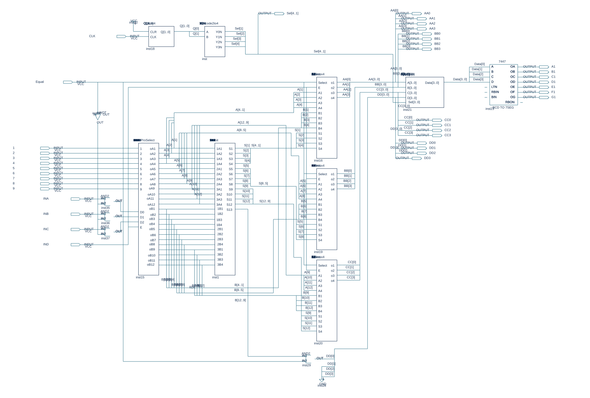

# Digital Logic Lab — Decimal Adder

มินิโปรเจกต์วงจรบวกฐานสิบที่ผู้จัดทำระบุว่าออกแบบเองระหว่างเรียน Digital Logic
เก็บวงจรต้นฉบับแบบ Block Diagram รวมทั้งวงจรย่อยและ waveform

## เปิดงานจริง

1. เปิด Quartus II ที่รองรับ FLEX10K (ต้นฉบับใช้ **9.0 Web Edition**)
2. เปิด `miniProjectAdder.qpf` แล้วเปิด `miniProjectAdder.bdf`
3. ดับเบิลคลิกบล็อกเพื่อดู `12bit`, `LHHL`, `TestProSelect`, `Multiplex`, `16mux4`, `Count4`, `Decode2to4`
4. เปิด `miniProjectAdder.vwf` เพื่อดูอินพุตการจำลองเดิม ก่อนสั่ง compile/simulation

อุปกรณ์ใน QSF: `EPF10K10LC84-4` มี pin assignment เดิมครบ
ลบเฉพาะ MISC_FILE ที่ชี้ไปไดรฟ์เครื่องเก่าออกจากสำเนา QSF

รายงานต้นฉบับ `miniProjectAdder.flow.rpt` ระบุ Successful เมื่อ 18 ตุลาคม 2024
นี่เป็นหลักฐานผลเดิม ไม่ใช่ผล compile ใหม่ ปัจจุบันยังไม่ได้จำลองความถูกต้องครบทุกค่าหรือทดสอบบนบอร์ด
ภาพ SVG สร้างจากตำแหน่งและข้อความใน BDF เพื่อเปิดดูบน GitHub ไม่ใช่ screenshot จาก Quartus และไม่ใช่ simulator

Repository แยกตามวิชา/หัวข้องานเรียน คงโค้ดและเครดิตเดิมไว้ ดูที่มาไฟล์ใน [provenance.json](provenance.json)
