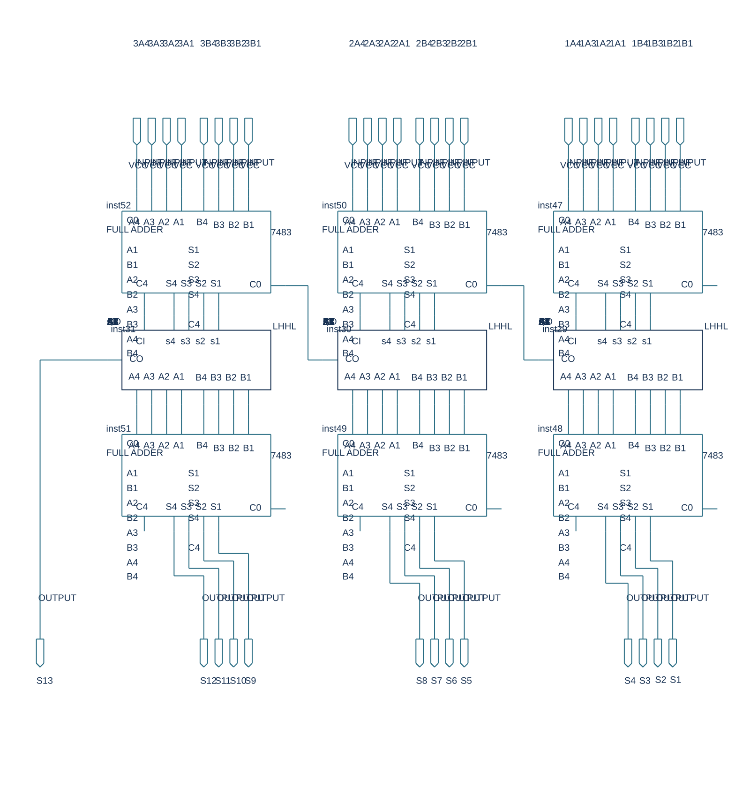
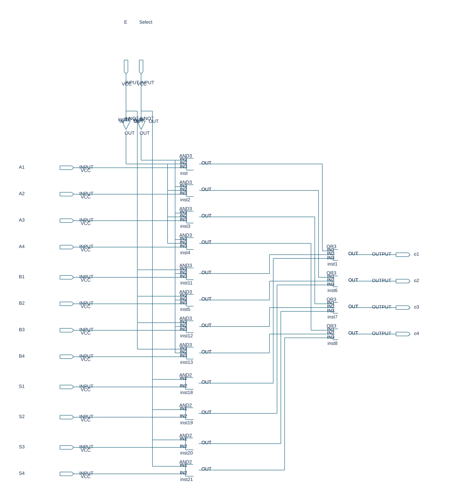
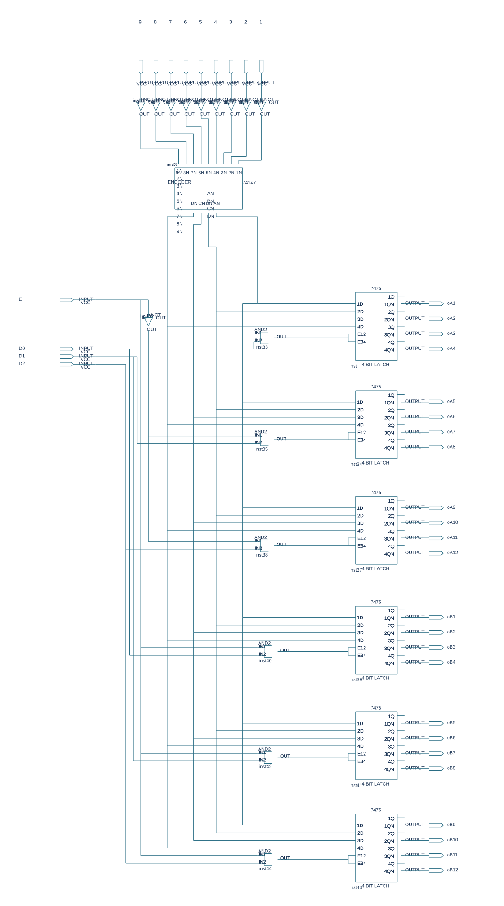
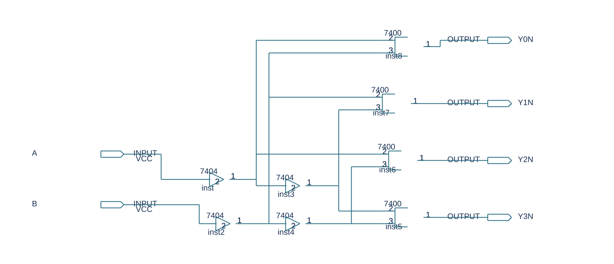
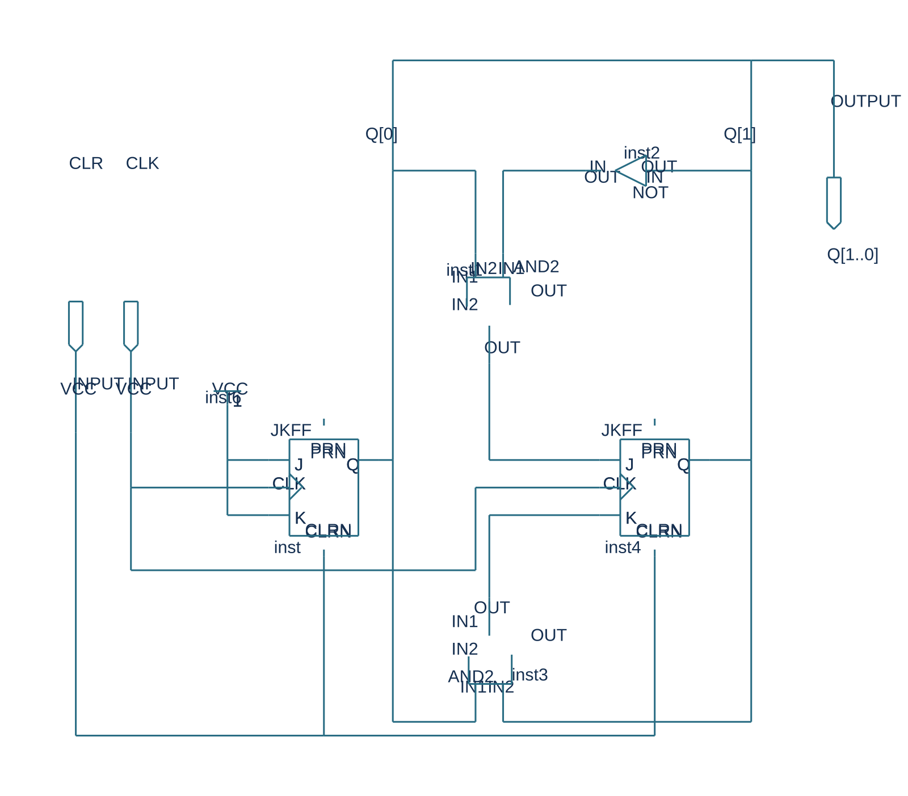

# Digital Logic — 12-Bit Decimal (BCD) Adder System

มินิโปรเจกต์ออกแบบและพัฒนาวงจรบวกเลขฐานสิบ (Decimal / BCD Adder) ขนาด 12-bit จากการวางลอจิกและสร้างบล็อกวงจรย่อยด้วยตนเองทั้งหมด ออกแบบโดยใช้โปรแกรม Quartus II เพื่อลงบนชิป Altera FPGA (FLEX10K - EPF10K10LC84-4) พร้อมการจำลองสัญญาณ Waveform

---

## 1. ภาพรวมสถาปัตยกรรมวงจรหลัก (Top-Level Circuit)

วงจรหลักทำหน้าที่รับข้อมูลอินพุตขนาด 12-bit ประมวลผลการบวกเลขฐานสิบข้ามหลัก พร้อมระบบควบคุมการเลือกส่งสัญญาณและการแสดงผลข้อมูล โดยเชื่อมโยงโมดูลย่อยและลอจิกเกตเข้าด้วยกันผ่านไฟล์ Block Diagram File (`miniProjectAdder.bdf`)

---

## 2. วงจรและโมดูลย่อยที่ออกแบบ (Sub-IC Modules)

วงจรนี้ถูกแบ่งออกเป็นโมดูลย่อย (Hierarchical Modular Design) โดยออกแบบลอจิกของแต่ละบล็อกขึ้นมาเฉพาะ เพื่อให้การประมวลผลและการจัดสรรสัญญาณทำงานได้อย่างถูกต้องและเป็นระบบ

### 2.1 วงจรบวกเลขฐานสิบ 12 บิต (12-Bit Adder Core — `12bit.bdf`)
แกนหลักของการคำนวณ ทำหน้าที่บวกตัวเลขฐานสิบขนาด 12-bit พร้อมวงจรลอจิกตรวจสอบผลบวกเมื่อค่าเกิน 9 (BCD Correction) เพื่อจัดการส่งต่อตัวทด (Carry Out) ข้ามหลักอย่างถูกต้อง

### 2.2 วงจรมัลติเพล็กเซอร์ 16-to-4 (`16mux4.bdf` & `Multiplex.bdf`)
วงจรเลือกส่งข้อมูลขนาด 16 ช่องสัญญาณออกเป็น 4 ช่องสัญญาณ ทำหน้าที่จัดระเบียบและสลับเลือกส่งชุดข้อมูลตัวเลขในแต่ละหลักเข้าสู่ขั้นตอนการประมวลผล

### 2.3 วงจรเลือกสัญญาณควบคุมและทดสอบ (`TestProSelect.bdf`)
โมดูลควบคุมการสลับโหมดและคัดเลือกสัญญาณทดสอบ ทำงานร่วมกับบล็อกจัดการสัญญาณระดับบิต (`LHHL.bdf`) เพื่อกำหนดค่าสถานะการคำนวณ

### 2.4 วงจรถอดรหัสสัญญาณ (`Decode2to4.bdf`)
วงจร 2-to-4 Binary Decoder สำหรับแปลงรหัสควบคุม 2 บิตเป็นสัญญาณเปิดใช้งาน 4 แชนเนล เพื่อเลือกเปิดการทำงานของโมดูลย่อยตามสเต็ปเวลา

### 2.5 วงจรตัวนับ 4 บิต (`Count4.bdf`)
วงจร 4-Bit Synchronous Counter สำหรับสร้างจังหวะการนับและควบคุมรอบการทำงานของระบบ

---

## 3. การจำลองสัญญาณเวลา (Waveform Simulation)

ระบบผ่านการทดสอบและยืนยันความถูกต้องของการคำนวณด้วยไฟล์การจำลองสัญญาณ Waveform (`miniProjectAdder.vwf`) ใน Quartus II เพื่อตรวจสอบ:
- ความถูกต้องของการบวกเลขในทุกกรณีทดสอบ (รวมถึงกรณีมีตัวทดข้ามหลัก)
- Timing Diagram และสัญญาณหน่วงเวลา (Propagation Delay) ของแต่ละช่วงสัญญาณนาฬิกา

---

## 4. รายละเอียดไฟล์ในโปรเจกต์

| ไฟล์ | หน้าที่ |
|---|---|
| `miniProjectAdder.qpf` | ไฟล์โปรเจกต์ Quartus II หลัก (รองรับ Quartus II 9.0 Web Edition ขึ้นไป) |
| `miniProjectAdder.bdf` | บล็อกไดอะแกรมวงจรหลัก (Top-Level Schematic) |
| `miniProjectAdder.qsf` | การตั้งค่าโปรเจกต์และการกำหนด Pin Assignment สำหรับ FPGA |
| `miniProjectAdder.vwf` | การจำลองรูปคลื่นสัญญาณ (Timing Waveform Simulation) |
| `*.bdf` / `*.bsf` | ไฟล์วงจรและสัญลักษณ์ของแต่ละโมดูลย่อย (12bit, 16mux4, Count4, Decode2to4, TestProSelect, LHHL, Multiplex) |